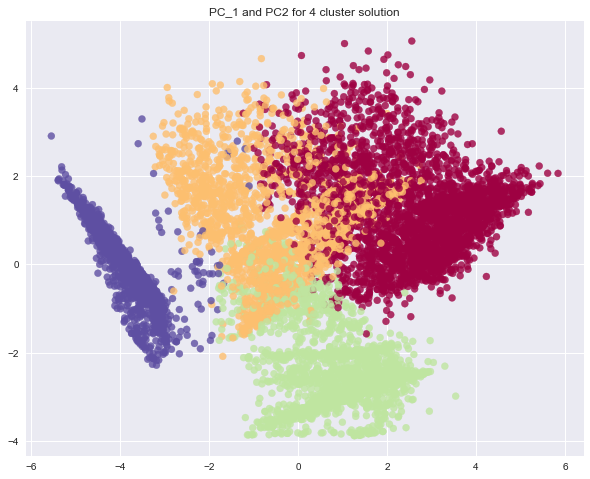

# Banking-Customer-Segmentation-Credit-Card-
Develop a customer segmentation to define marketing strategy. Used PCA to reduce dimensions of the dataset and KMeans++ clustering technique is used for clustering and profiling of clusters.

# Credit Card Customer Segmentation

